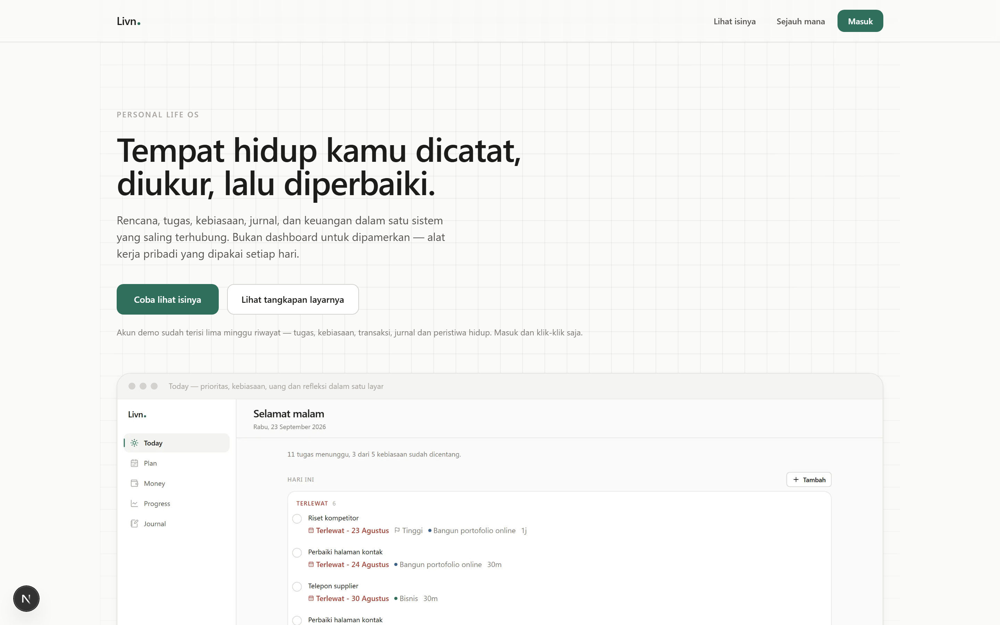
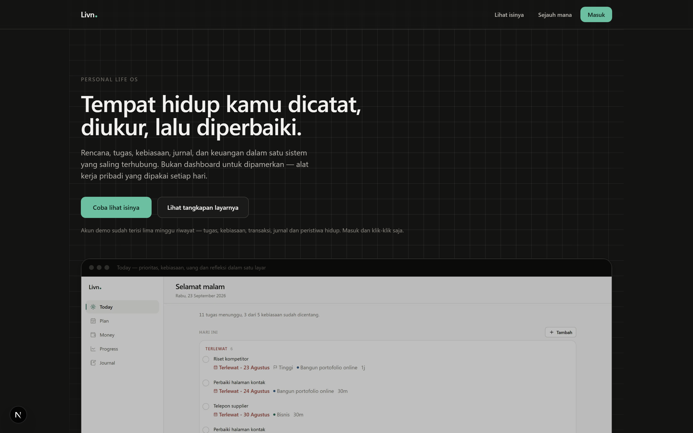

# Livn — Personal Life OS

A private system for one person to plan, execute, record, measure and improve their own
life. Plan, tasks, habits, journal and finance in one connected tool.

Not a dashboard demo. Every percentage, balance and chart is derived from records that
actually exist.

> **Status: in progress.** What works and what does not is listed under
> [Current state](#current-state). Nothing is claimed that cannot be checked by
> opening the application.

---

## What it does

The product answers five questions in a loop:

```
PLAN      What am I trying to accomplish?
  ↓
DO        What should I do today?
  ↓
RECORD    What actually happened?
  ↓
MEASURE   How am I progressing?
  ↓
REFLECT   What should I change?
  ↓
PLAN AGAIN
```

Finance is one dimension of that loop, not a separate application bolted on beside it.

### Screens

<table>
<tr>
<td width="50%">

**Light**



</td>
<td width="50%">

**Dark**



</td>
</tr>
</table>

The hero carries a reactive grid backdrop that drifts toward the pointer, with a soft
light that follows it. It reads from theme tokens, so both palettes are tuned separately:
a hairline drawn at the light theme's opacity is invisible on a near-black canvas. The
effect disabled itself under `prefers-reduced-motion`.

| Screen | What it is for |
| --- | --- |
| **Today** | The daily operating surface: priorities, habits, money, progress, reflection |
| **Plan** | Areas → Goals → Projects → Milestones → Tasks, in one hierarchy |
| **Money** | A ledger with derived balances, budgets and savings |
| **Progress** | Daily through yearly metrics, with like-for-like comparison |
| **Journal** | Daily entries, life events, and a global timeline |

---

## Principles the code follows

These are not aspirations; they are enforced by the architecture.

**No invented numbers.** Every figure is computed from stored records. There is no
decorative statistic, no placeholder chart, and no seed data mixed into a real account.

**Balances are derived, never stored.** An account's balance is
`openingBalance ± every transaction effect`, recomputed on read. A stored balance and a
ledger drift apart; one of them is wrong and you cannot tell which.

**Transfers are not income or expense.** Moving money between your own accounts changes
two balances and neither flow. Counting it would inflate both.

**History is not overwritten.** A mistaken transaction is corrected with a reversing
entry that links back to the original. Both stay visible. A hard delete would silently
change figures that were already reported.

**One calculation, one place.** Completion rate, habit consistency, budget utilisation
and savings progress each have exactly one implementation. A number shown on Progress
and quoted in a review come from the same function.

**Skipped work still counts.** A task deliberately skipped stays in the denominator of
its period. Removing it would let a week where half the plan was abandoned report as a
perfect week.

**Consistency over streaks.** A habit is measured by how often it was actually kept, not
by an unbroken run. One missed day does not erase three weeks of work — and weekly
habits are measured per week, so a perfectly-kept 4×/week habit reads as 100%, not 57%.

---

## Architecture

```
src/
  app/                    Next.js App Router
    (marketing)/          Public landing content
    (auth)/               Sign in, sign up
    (app)/                Authenticated shell: Today, Plan, Money, Progress, Journal, Settings
  domains/                Business logic, one folder per bounded context
    auth/                 Registration, sessions, starter data
    plan/                 Areas, goals, projects, milestones, tasks
    habits/               Frequencies, streaks, consistency
    journal/              Entries, life events, timeline
    finance/              Ledger, accounts, categories, summaries
    analytics/            Cross-domain metrics
  lib/                    Infrastructure shared by every domain
  components/             Presentation only
  styles/                 Design tokens
prisma/
  schema.prisma           26 tables, 62 foreign keys
```

**Domain-driven, not layer-driven.** `domains/finance/service.ts` owns every finance rule.
Nothing in `components/` calculates anything.

### Why the infrastructure looks the way it does

| Decision | Reason |
| --- | --- |
| **Money is `BigInt` minor units** | Floating point cannot represent `0.1`. A ledger that drifts by a fraction of a cent per row is worse than useless — it is actively misleading. |
| **Calendar days are separate from instants** | A transaction at 23:30 in Jakarta is the 23rd locally but the 24th in UTC. `date.ts` keeps the two concepts apart and says which is which. |
| **Reversing entries, not deletes** | A correction must not rewrite a figure that has already been reported. |
| **Batched aggregate queries** | Goals, habits and projects compute their metrics for a whole page in one or two grouped queries. A per-row query is an N+1 that grows with usage. |
| **Vocabulary split from services** | Client components import constants from `domain/vocabulary.ts`. Importing the service would pull `@prisma/adapter-pg` → `pg` → `fs` into the browser bundle and break every page. |
| **Ownership checked on every access** | `assertOwned` scopes each query by `userId`. Relying on the UI to send only your own ids is not a security model. |

---

## Current state

### Working

- **Today** — aggregation of tasks, habits, money, goals and reflection
- **Plan** — areas, goals (manual and derived), projects, milestones, tasks
- **Habits** — daily/weekly/monthly frequencies, streaks, consistency
- **Money** — accounts, categories, income, expenses, transfers, adjustments, reversal,
  derived balances, month summaries, category breakdown
- **Journal** — one entry per day, optional mood/energy/focus, tags, links to goals
- **Life events** and a merged global timeline
- **Progress** — daily, weekly, monthly and yearly metrics with charts
- **Authentication** — session-based, hashed tokens, per-user data isolation

### Not built yet

- Monthly budgets and savings goals
- Recurring transactions and cash-flow forecasting
- Stored weekly/monthly reviews
- Global search
- Data export and account deletion from the interface
- Attachments
- Insights and anomaly detection

Eight tables exist in the schema ahead of the features that will use them:
`Budget`, `SavingsGoal`, `RecurringRule`, `Review`, `Insight`, `Attachment`,
`MonthlyPlan` and `MonthlyPlanTarget`. They are deliberately defined early so the
relationships are settled before the code that relies on them is written.

### Verification

Correctness is checked against the real database, not mocks. Run:

```powershell
_tools\verify-all.ps1
```

| Suite | Covers |
| --- | --- |
| `db-smoke` | Connection, 26 tables, 62 foreign keys, money arithmetic |
| `verify-register` | Account creation, starter data, password hashing, duplicate guard |
| `verify-plan` | Hierarchy, derived goal and project progress, ownership, referential guards |
| `verify-habits` | Streaks, consistency, weekly vs daily frequency, idempotency |
| `verify-journal` | One entry per day, tag replacement, timeline merge and exclusions |
| `verify-analytics` | Period arithmetic, exclusions, day bucketing, comparisons |
| `verify-finance` | Balances after every operation, reversal, transfers, validation |

Plus checks that are not behavioural:

| Script | Covers |
| --- | --- |
| `visual-qa.mjs` | Route walk, console errors, horizontal overflow |
| `check-mobile.mjs` | Tap targets, bottom bar, content overlap |
| `a11y-names.mjs` | Accessible names on every interactive control |
| `audit-links.ts` | Every internal `href` resolves to a real route |
| `audit-project.ts` | npm scripts, unused dependencies, README accuracy, table accessors, route states |
| `audit-encoding.py` | Mojibake in strings that would render as garbage |
| `check-amount-signs.mjs` | An expense is never displayed as money coming in |

---

## Running it

**Requirements:** Node 20+, PostgreSQL 14+.

```powershell
# 1. Environment
Copy-Item .env.example .env
#    Set DATABASE_URL and a long random SESSION_SECRET

# 2. Install and prepare the database
npm install
npm run db:push
npm run db:generate

# 3. Start
_tools\start.ps1        # or: npm run dev
```

Open <http://localhost:3777>, create an account, and the starter areas, categories and
accounts are created for you.

### Optional: demo data

To see the charts and statistics with realistic history:

```powershell
npx tsx scripts/create-demo-user.ts
npx tsx scripts/seed-demo.ts demo@livn.test
```

Sign in as `demo@livn.test` / `lihat-livn-2026`.

### Sharing a running instance

```powershell
_tools\tunnel.ps1        # prints a public URL
```

Forwards to the local dev server, so changes appear for the visitor on refresh.

---

## Stack

Next.js 15 (App Router) · TypeScript (strict) · Tailwind with design tokens ·
Prisma 7 with the `@prisma/adapter-pg` driver · PostgreSQL · Zod · Vitest ·
Playwright for browser verification.

No charting library: the three shapes needed are hand-built SVG, and the alternative is
a dependency larger than the rest of the application.

---

## Licence

Private project. Not licensed for redistribution.
